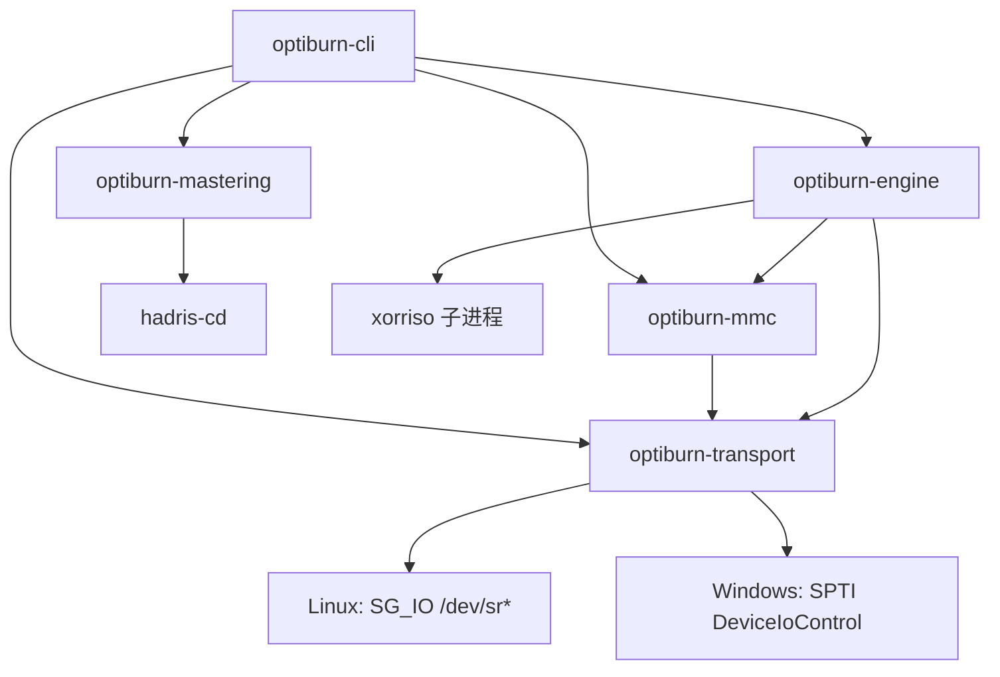

# 架构

optiburn 是一个跨平台（Linux / Windows × x86_64 / arm64）的光盘刻录工具链：把目录做成
Windows 能读的镜像，再把镜像写到盘上。本文件说明各 crate 的边界、数据怎么流动，以及
哪些能力是 v0 就有、哪些在路线图上。

## 分层



依赖方向只有一条，自上而下：`cli` 依赖 `engine`、`mastering`、`mmc`，并直接依赖
`transport`（probe 用它打开与枚举设备）。`engine` 依赖 `mmc` 与 `transport`（原生引擎用
前者发命令、用后者打开设备），`mastering` 依赖 `hadris-cd`，`mmc` 依赖 `transport`。没有反向依赖，也没有 crate 之间互相认识对方的实现。

```
optiburn-cli        命令行：build-image / burn / probe
├── optiburn-mastering   目录做成镜像文件（ISO 9660 + Joliet + UDF Bridge）
│   └── hadris-cd        上游镜像写入器（MIT，纯 Rust）
├── optiburn-engine      镜像写到盘（xorriso 子进程与原生 MMC 引擎）
└── optiburn-mmc         MMC 命令编解码（读侧与写侧）
    └── optiburn-transport   SCSI 传输（Linux SG_IO / Windows SPTI）
```

## 数据流

```
源目录 ──build_image──▶ .iso（ISO 9660 + Joliet + UDF Bridge）
                          │
                          ├─ 归档/校验/分发：镜像本身与盘上字节一一对应
                          └─ BurnJob ──BurnEngine──▶ 光驱
                                          v0：xorriso -as cdrecord
                                          v0.5：原生 MMC 写入
盘 ──probe──▶ 设备标识 + 盘片状态（SG_IO/SPTI + READ DISC INFORMATION）
```

镜像先落盘再写盘（ADR-0003）是有意为之：镜像文件本身就是可归档、可校验的分发单元，
没有光驱也能把整条链路测完，写盘失败还能重试。注意镜像内含构建时刻的时间戳（上游把
`now()` 写进 ISO 卷描述符与 UDF 时间戳），所以同一目录两次构建的字节并不相同。可复现
的是目录顺序与内容，不是镜像字节。

## 各 crate 的接口与隐藏内容

### optiburn-transport

接口：`ScsiTransport::issue(cdb, dir, data, timeout)` 一条同步命令，加上
`Direction`／`Completion`／`TransportError`，按平台分发的 `open(device)`，
`list_optical_devices()`（枚举本机光驱设备路径，非 Linux 返回空列表），以及
`mounted_at(device)`（设备被系统挂载时返回挂载点，写前门禁据此拦截，见 ADR-0010）。

隐藏：`SG_IO` 的 `sg_io_hdr` 组装、SPTI 的 `SCSI_PASS_THROUGH_DIRECT` 组装、
两套方向枚举语义相反这件事（Linux `SG_DXFER_TO_DEV = -2`，Windows
`SCSI_IOCTL_DATA_OUT = 0`）、句柄生命周期、超时单位（Linux 毫秒 / Windows 秒）。

不变量：CDB 最多 16 字节，超长返回 `CdbTooLong` 而不是 panic。sense 最多 32 字节。
宿主机层错误（`host_status` / 驱动状态）也算失败，不允许悄悄成功。

### optiburn-mmc

接口：`MmcDevice` 上的读侧命令 `inquiry`、`test_unit_ready`、`read_disc_information`、
`read_track_information`、`read_toc_session_info`、`read_capacity`、`read_blocks`、
`read_format_capacities` 与 `read_disc_capacity`，与写侧命令 `get_configuration`、
`set_write_parameters`、`reserve_track`、`write_blocks`、`synchronize_cache`、
`close_session`。返回 `Inquiry` / `DiscInformation` / `TrackInfo` / `SessionInfo` /
`MediaKind` / `FormatCapacity` / `DiscCapacity` 等结构。`DiscCapacity` 是给上层的
容量视图（总容量与可用容量），两个口径的来源与退回规则见 ADR-0019。

隐藏：CDB 字节序与分配长度字段位置（`READ DISC INFORMATION` 的分配长度在 CDB 第
7–8 字节）、响应里哪些位是盘片状态（字节 2 的低 2 位，同一字节还带 last-session 状态与
erasable 标志）、尾部空格与 NUL 填充、短响应判定（用 `residual` 反推实际长度）、
READ FORMAT CAPACITIES 的变长列表解析（按实际长度而不是满长判定，描述符类型位在
字节 4 的低 2 位，实机验证见 ADR-0019）、写参数页（Mode Page 5）的字段、Close
Function 的位置、Profile 到写序列分组的映射。写侧 CDB 与字段逐条对照 libburn，
见 ADR-0017。

没有的东西：增长模式（合并既有区段）要读出旧区段目录树并合并重写，留给原生增长
模式那一步。CD 介质的 ATIP 读取仍未实现（format 字段布局有两种写法被实机证伪），
容量不依赖它（见 ADR-0019）。

### optiburn-mastering

接口：`build_image(source_dir, output, spec) -> ImageInfo`。`ImageSpec` 只有三件事：
介质 profile、卷标、是否 Joliet。

隐藏：profile 到文件系统的映射表（本文件之上和 `docs/WINDOWS-COMPAT.md` 里那张表）、
hadris-cd 的选项组装、输出文件必须以读写方式打开（hadris 写完卷描述符后会回读并就地
打补丁，只写句柄会 `EBADF`）、镜像按 2048 字节扇区对齐。

不变量：同一输入的目录顺序确定（hadris 的 `FileTree::from_fs` 递归读取时按名字排序、
跳过符号链接），但镜像内含构建时刻时间戳，字节不跨次一致。`ImageInfo.filesystems` 从真正
交给写盘器的选项反推，`ImageInfo.sectors` 只在字节数是 2048 的整数倍时给出（否则报
`MisalignedImage`，不假装知道扇区数）。

### optiburn-engine

接口：两种引擎接在同一个 `BurnEngine::{name, burn}` 接缝上（`XorrisoEngine` 子进程、
`NativeEngine` 自己发 MMC 命令，见 ADR-0017），输入 `BurnJob`：镜像、设备、倍速、是否
多区段。追加刻录 `grow`（输入 `GrowJob`：源目录、设备、倍速、卷标、是否封盘）同样按
平台分派：Windows 用原生增长模式（`native::grow` 读旧区段、生成新区段，生成器在
`grow.rs` 与 `grow/old_session.rs`，见 ADR-0020），Linux 维持 xorriso 增长模式。
原生引擎拒绝时会给出结构化的 `NativeGap`。进度都通过 `&mut dyn FnMut(f32)` 回调。
另有读侧的五个能力 `read_volume_id`、`list_tree`、`extract_tree`、`extract_paths`、
`last_session_is_iso`，接在 `ReadBackend` 接缝上（`XorrisoRead` 子进程与 `NativeRead`
原生块读加 ISO 9660/UDF 解析，Windows 默认原生，见 ADR-0018 与 ADR-0021），
`grow_size`（增长模式预演，返回即将写入的新区段字节数，供写前容量门禁比较。
Linux 是 `xorriso -print_size`，Windows 是原生会话计划的尺寸），以及
`compare_trees`（按文件名与内容单向对比，见 ADR-0010）。容量门禁的区段开销余量
共用常量 `SESSION_OVERHEAD`。

隐藏：`xorriso -as cdrecord` 与增长模式（`-dev … -map <目录> / -commit`，见
ADR-0006）的参数拼装（路径按 `OsStr` 原样传递，不做有损转换）、stderr 上的百分比
解析、失败时从 stderr 尾部取摘要、区分工具缺失（`MissingTool`，载荷只有工具名，
安装指引由 CLI 与 GUI 按系统给出，见 ADR-0004 补记）与其它 I/O 错误（`Io`）、
原生写序列（起点取 NWA、写参数页、关区段）与块与块之间的取消检查、原生读侧的
末区段定位（READ TOC Format 1）、两种区段地址约定的探测与 UDF 的三种定位约定
（ADR-0018、ADR-0021）、原生增长的会话布局（绝对地址、两套目录树、四张路径表，
ADR-0020）。

已知不足：xorriso 引擎的进度只是粗粒度提示，cdrecord 风格输出里缓冲区/fifo 的百分比
与写入百分比同格式，且成功时统一补发 1.0。原生引擎的进度按已写块数算，是精确的。
原生引擎的缺口（倍速、写失败重试）见 ADR-0017。原生增长的形状限制（无 Joliet、
启动记录、多 extent、Rock Ridge 元数据不结转）见 ADR-0020。UDF 读侧的能力边界见
ADR-0021。

### optiburn-cli

接口：四个子命令，其余全是实现细节。`burn` 与 `append` 先跑前置检查
（`ensure_burnable`：挂载占用与末区段格式直接拒绝，等介质就绪，按盘片状态路由
放行或拒绝，见 ADR-0006 与 ADR-0010），再过写前容量门禁（`ensure_fits`：待写入
量加区段开销超过可用容量直接拒绝，读不到容量口径则跳过，见 ADR-0019），然后进
引擎。`probe` 在任何情况下都以 0 退出（没光驱不是错误），行尾带盘片容量（读得到
口径时）。真正失败（路径不存在、刻录退出码非零）退 1 并把原因写到 stderr。

## 路线图

- v0（当前）：镜像层 + xorriso 子进程刻录 + 只读探测。
- v0.5 原生 MMC 写入（已落地，ADR-0017）：接在 `BurnEngine` 同一个接缝上，自己发
  MMC 命令（`MODE SELECT` 写参数页、`WRITE(10)` 分块写、`SYNCHRONIZE CACHE`、
  `CLOSE TRACK/SESSION`，起点取 NWA），写后可用 `READ(10)` 读回对拍。Windows 上
  没有可用的外部引擎（见下节），这条同时是 Windows 刻录的唯一路径。剩余：倍速参数、
  DAO/SAO 路径，以及 DVD/BD 各族的真机验证（CD-R 已过）。
- v0.6 原生读盘（已落地，ADR-0018）：MMC 读块加 hadris-iso 的 ISO 9660 解析，
  接在 `ReadBackend` 接缝上，Windows 上读侧不再依赖外部程序，UDF 盘读侧已补齐
  （ADR-0021）。剩余：Rock Ridge 名的显式优先策略、非 CD 介质上区段信息假值的
  真机验证。
- v0.7：介质容量已落地（可用容量取 `READ TRACK INFORMATION` 的剩余块数，
  `READ FORMAT CAPACITIES` 兜底，`probe` 与 GUI 设备页/追加页显示，写盘前容量
  门禁，见 ADR-0019）。ATIP 读取仍缺，容量不依赖它。
- 后续：BD-R 伪覆盖、Windows 上的 IMAPI2 校验（仅校验，不接管写入，
  见 ADR-0005）。多区段追加两条路都已覆盖：Linux 走 xorriso 增长模式（ADR-0006），
  Windows 走原生增长模式（ADR-0020）。

## 平台支持现状

| 能力 | Linux x86_64/arm64 | Windows x86_64/arm64 |
|---|---|---|
| `build-image` | 可用 | 可用 |
| `burn`（`--engine xorriso` 或 `native`） | 可用（xorriso 需要写设备权限，native 未在 Linux 真机验证） | 可用（`native`，GUI 默认，2026-10-10 在 CD-R 上真机验证，DVD/BD 各族待介质） |
| `append`（xorriso 增长模式 / 原生增长模式） | 可用（xorriso），前置检查按盘片状态自动路由 | 可用（原生增长模式，ADR-0020）：唯一能取得的 xorriso 不含光驱访问（ADR-0008 补记），Windows 走原生会话生成器 |
| `probe` | 可用（`/dev/sr*`） | 可用（枚举盘符，2026-10-10 在 USB 光驱上实测） |
| 读盘（浏览、回读校验、卷标、末区段门禁） | 可用（xorriso） | 可用（`native`，GUI 默认，2026-10-10 在 CD-R 上真机验证，两种区段地址约定都实测读通。UDF 盘的读侧见 ADR-0021。复制到剪贴板仅 Linux，见 ADR-0012） |
| 原生 MMC 传输 | 可用（`SG_IO`） | 可用（SPTI，2026-10-10 在 USB 光驱上实测） |

GUI 的读盘功能（设备页浏览、回读校验、追加页卷标预填）在 Windows 走原生读盘
（ADR-0018），不需要外部工具，复制到系统剪贴板仍只在 Linux 生效（ADR-0012）。
`cargo check` 覆盖四个目标三元组。
SPTI 的写侧已在 CD-R 上真机验证，DVD/BD 各族还没有介质。
