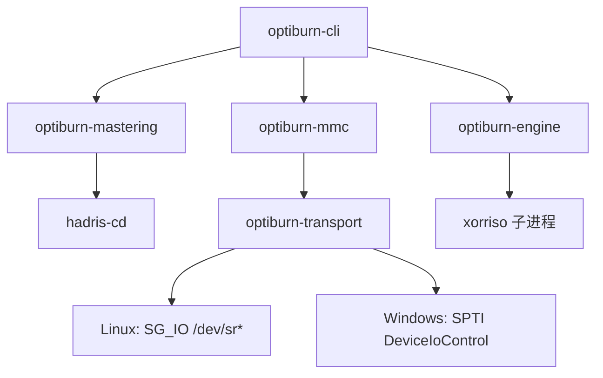

# 架构

optiburn 是一个跨平台（Linux / Windows × x86_64 / arm64）的光盘刻录工具链：把目录做成
Windows 能读的镜像，再把镜像写到盘上。本文件说明各 crate 的边界、数据怎么流动，以及
哪些能力是 v0 就有、哪些在路线图上。

## 分层



依赖方向只有一条：`cli → {engine, mastering, mmc} → {hadris-cd, transport}`。没有反向
依赖，也没有 crate 之间互相认识对方的实现。

```
optiburn-cli        命令行：build-image / burn / probe
├── optiburn-mastering   目录 → 镜像文件（ISO 9660 + Joliet + UDF Bridge）
│   └── hadris-cd        上游镜像写入器（MIT，纯 Rust）
├── optiburn-engine      镜像 → 盘（v0：xorriso 子进程）
└── optiburn-mmc         MMC 命令编解码（v0：读侧）
    └── optiburn-transport   SCSI 传输（Linux SG_IO / Windows SPTI）
```

## 数据流

```
源目录 ──build_image──▶ .iso（ISO 9660 + Joliet + UDF Bridge）
                          │
                          ├─ 归档/校验/分发：镜像本身与盘上字节一一对应
                          └─ BurnJob ──BurnEngine──▶ 光驱
                                          v0：xorriso -as cdrecord
                                          v0.5：原生 MMC 写入
盘 ──probe──▶ 设备标识 + 盘片状态（SG_IO/SPTI + READ DISC INFORMATION）
```

镜像先落盘再写盘（ADR-0003）是有意为之：镜像文件本身就是可归档、可校验的分发单元，
没有光驱也能把整条链路测完，写盘失败还能重试。注意镜像内含构建时刻的时间戳（上游把
`now()` 写进 ISO 卷描述符与 UDF 时间戳），所以同一目录两次构建的字节并不相同——可复现
的是目录顺序与内容，不是镜像字节。

## 各 crate 的接口与隐藏内容

### optiburn-transport

**接口**：`ScsiTransport::issue(cdb, dir, data, timeout)` 一条同步命令，加上
`Direction`／`Completion`／`TransportError`，以及按平台分发的 `open(device)`。

**隐藏**：`SG_IO` 的 `sg_io_hdr` 组装、SPTI 的 `SCSI_PASS_THROUGH_DIRECT` 组装、
两套方向枚举语义相反这件事（Linux `SG_DXFER_TO_DEV = -2`，Windows
`SCSI_IOCTL_DATA_OUT = 0`）、句柄生命周期、超时单位（Linux 毫秒 / Windows 秒）。

**不变量**：CDB 最多 16 字节，超长返回 `CdbTooLong` 而不是 panic；sense 最多 32 字节；
宿主机层错误（`host_status` / 驱动状态）也算失败，不允许悄悄成功。

### optiburn-mmc

**接口**：`MmcDevice::{inquiry, test_unit_ready, read_disc_information}` 三个读侧命令，
返回 `Inquiry` / `DiscInformation` / `DiscStatus` 结构。

**隐藏**：CDB 字节序与分配长度字段位置（`READ DISC INFORMATION` 的分配长度在 CDB 第
7–8 字节）、响应里哪些位是盘片状态（字节 2 的低 2 位，同一字节还带 last-session 状态与
erasable 标志）、尾部空格与 NUL 填充、短响应判定（用 `residual` 反推实际长度）。

**没有的东西**：写侧命令。路线图落地前不留空壳类型。

### optiburn-mastering

**接口**：`build_image(source_dir, output, spec) -> ImageInfo`。`ImageSpec` 只有三件事：
介质 profile、卷标、是否 Joliet。

**隐藏**：profile 到文件系统的映射表（本文件之上和 `docs/WINDOWS-COMPAT.md` 里那张表）、
hadris-cd 的选项组装、输出文件必须以**读写**方式打开（hadris 写完卷描述符后会回读并就地
打补丁，只写句柄会 `EBADF`）、镜像按 2048 字节扇区对齐。

**不变量**：同一输入的目录顺序确定（hadris 的 `FileTree::from_fs` 递归读取时按名字排序、
跳过符号链接），但镜像内含构建时刻时间戳，字节不跨次一致；`ImageInfo.filesystems` 从真正
交给写盘器的选项反推，`ImageInfo.sectors` 只在字节数是 2048 的整数倍时给出（否则报
`MisalignedImage`，不假装知道扇区数）。

### optiburn-engine

**接口**：`BurnEngine::{name, burn}`，输入 `BurnJob`（镜像、设备、倍速、是否多区段），
进度通过 `&mut dyn FnMut(f32)` 回调。

**隐藏**：`xorriso -as cdrecord` 的参数拼装（镜像路径按 `OsStr` 原样传递，不做有损转换）、
stderr 上的百分比解析、失败时从 stderr 尾部取摘要、区分工具缺失（`MissingTool`，附安装
提示）与其它 I/O 错误（`Io`）。

**已知不足**：v0 的进度只是粗粒度提示——cdrecord 风格输出里缓冲区/fifo 的百分比与写入
百分比同格式，且成功时统一补发 1.0；精确进度要等原生 MMC 引擎自己数 LBA。

### optiburn-cli

**接口**：三个子命令，其余全是实现细节。`probe` 在任何情况下都以 0 退出（没光驱不是
错误）；真正失败（路径不存在、刻录退出码非零）退 1 并把原因写到 stderr。

## 路线图

- **v0（当前）**：镜像层 + xorriso 子进程刻录 + 只读探测。
- **v0.5 原生 MMC 写入**：接在 `BurnEngine` 同一个接缝上，把 xorriso 换成自己发的
  MMC 命令序列：`RESERVE TRACK` → `SEND OPC INFORMATION`（可选，选定倍速与写入参数）
  → `WRITE(10)` 分块写数据（每块 32–64 扇区，按盘片类型调整）→ `SYNCHRONIZE CACHE`
  → `CLOSE TRACK/SESSION`，全程用 `TEST UNIT READY` + `REQUEST SENSE` 处理驱动器繁忙。
  这一层只多学 `optiburn-mmc` 的写侧命令，不需要新 crate。
- **v0.6**：`probe` 增加介质容量（`READ CAPACITY` / `GET CONFIGURATION`），
  `build-image` 据此在写盘前就拒绝放不下的镜像。
- **后续**：多区段追加、BD-R 伪覆盖、Windows 上的 IMAPI2 校验（仅校验，不接管写入，
  见 ADR-0005）。

## 平台支持现状

| 能力 | Linux x86_64/arm64 | Windows x86_64/arm64 |
|---|---|---|
| `build-image` | ✅ | ✅ |
| `burn`（xorriso 引擎） | ✅ 需要 `xorriso` 与写设备权限 | ✅ 需要 `xorriso`（MSYS2 等） |
| `probe` | ✅ `/dev/sr*` | ❌ 尚未实现 |
| 原生 MMC 传输 | ✅ `SG_IO` | ✅ 编译通过，等有硬件时验证 |

`cargo check` 覆盖四个目标三元组；Windows 的 SPTI 代码路径只保证能编译，没有真机验证过
（本仓库没有 Windows 机器与光驱）。
